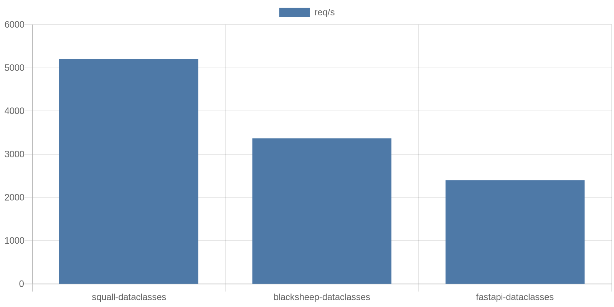

<p align="center">
    <a href="https://github.com/mtag-dev/squall/">
        
    </a>
</p>
<p align="center">
    <em>Squall, API framework which looks ahead</em>
</p>

[](https://github.com/psf/black)
[](https://pycqa.github.io/isort/)
[](https://opensource.org/licenses/MIT)
[](https://pypi.org/project/python-squall/)
[](https://github.com/mtag-dev/squall/actions/workflows/test.yml)
[](https://pypi.org/project/python-squall/)
[](https://pypi.org/project/python-squall/)

--- 
#### Navigation

- [About](#about)
  - [Motivation](#motivation)
  - [Performance](#performance)
  - [Disagreement](#disagreement)
  - [ASAP](#asap)
- [Usage](#usage)
  - [Install](#install)
  - [Quick start](#quick-start)
  - [OpenAPI](#openapi-generation)
  - [Routing](#routing)
  - [HEAD parameters](#head-parameters)
    - [Path](#path)
    - [Query](#query)
    - [Header](#header)
    - [Cookie](#cookie)
    - [Parameters configuration](#parameters-configuration)
    - [Parameters validation](#parameters-validation)
  - [Body processing](#body-processing)
    - [Response serialization](#response-serialization)
    - [Response deserialization serialization](#response-deserialization-serialization)
- [Acknowledgments](#acknowledgments)
- [Roadmap](#roadmap)
- [Dependencies](#dependencies)
- [Versioning](#versioning)
- [License](#license)


## About
### Motivation


### Performance

#### No schema

**1Kb**


**30Kb**


**1Kb**


**30Kb**


More results [here](https://github.com/mtag-dev/py-rest-stress-testing)

### Disagreement

There are some things that Squall disagree with: 

- Background tasks after response
- AuthN security enforcement in end-service
- Compression on reverse-proxy
- [TMTOWTDI](https://en.wikipedia.org/wiki/There%27s_more_than_one_way_to_do_it)
- [ASGI](https://asgi.readthedocs.io/en/latest/specs/index.html)

All further explanations will arrive in dedicated articles.

### ASAP

Squall following own MTAG/Squall ASAP pattern. The idea of the ASAP pattern is pretty simple to understand.
If you have all necessaries to do something you can do in the next steps, you should do it now.

Be careful. This pattern is mind-changing.

## Usage
### Install

```shell
pip3 install python-squall
```

You also need some ASGI server. Let's install Uvicorn, the most popular one.

```shell
pip3 install uvicorn
```

### Quick start

Create `example.py` with the following content

```Python
from typing import List, Optional
from dataclasses import dataclass
from squall import Squall

app = Squall()


@dataclass
class Item:
    name: str
    value: Optional[int] = None


@app.get("/get", response_model=List[Item])
async def handle_get() -> List[Item]:
    return [
        Item(name="null_value"),
        Item(name="int_value", value=8)
    ]


@app.post("/post", response_model=Item)
async def handle_post(data: Item) -> Item:
    return data
```

And run it

```shell
uvicorn example:app
```

Now, we are able to surf our GET endpoint on: http://127.0.0.1:8000/get

And let's play with `curl` on POST endpoint

```shell
# curl -X 'POST' 'http://127.0.0.1:8000/post' -H 'Content-Type: application/json' -d '{"name": "string", "value": 234}'
{
  "name": "string",
  "value": 234
}
```

Type checking and validation is done by [apischema](https://wyfo.github.io/apischema/) for both, Request and Response.


```shell
# curl -X 'POST' 'http://127.0.0.1:8000/post' -H 'Content-Type: application/json' -d '{"name": "string", "value": "not_an_int"}'
{
  "details": [
    {
      "loc": [
        "value"
      ],
      "msg": "expected type integer, found string"
    },
    {
      "loc": [
        "value"
      ],
      "msg": "expected type null, found string"
    }
  ]
}
```


### OpenAPI generation

OpenAPI for your app generates automatically based on route parameters and schema you have defined.

There are support for ReDoc and Swagger out of the box. You can reach it locally once your application started:

- Swagger: http://127.0.0.1:8000/doc
- ReDoc: http://127.0.0.1:8000/redoc


### Routing

Squall provides familiar decorators for any method route registration on both, application itself and on nested routers.

| Method   |      app      |  router * |
|:----------|:--------------|:------|
| GET | @app.get | @router.get |
| PUT | @app.put   | @router.put |
| POST | @app.post | @router.post |
| DELETE | @app.delete | @router.delete |
| OPTIONS | @app.options | @router.options |
| HEAD | @app.head | @router.head |
| PATCH | @app.patch | @router.patch |
| TRACE | @app.trace | @router.trace |

__* `router = squall.Router()`__

Nested routers supports prefixes and further nesting.

```Python
from squall import Router, Squall

animals_router = Router(prefix="/animals")


@animals_router.get("/")
async def get_animals():
    return []


@animals_router.get("/cat")
async def get_cat():
    return []

dogs_router = Router(prefix="/dogs")


@dogs_router.get("/list")
async def get_all_dogs():
    return []


animals_router.include_router(dogs_router)

app = Squall()
app.include_router(animals_router)
```

Will give us


Nested routing is usually used for splitting applications into files and achieving better project structure.

### HEAD parameters

There are four kinds of parameters that developers can get from HTTP headers. Squall offers an interface for their conversion and validation.

#### Path

"Path" is a dynamic value specified by developers in the route URL.

```Python
from squall import Squall, Path

app = Squall()


@app.get("/company/{company_id}/employee/{employee_id}")
async def get_company_employee(company_id: int, employee_id = Path()):
    return {
        "company_id": company_id,
        "employee_id": employee_id,
    }
```

Squall determinate affiliation of the variable with path by any of following ways:

- Default parameter value is `Path` instance  
- Parameter default name equal to route pattern

Specifics:
- Allows only the following annotations: `str`, `bytes`, `int`, `float`
- `Union`, `Optional`, not allowed. Because a path can't have an undefined value. Also, parameters must have a strong conversion contract.
- If an annotation isn't set parameter will arrive as `str`

Shares common configuration contract for head entities. Please, read more [here](#parameters-configuration).


#### Query

"Query" is a way get query string parameters value(s).

```Python
from typing import List
from squall import Squall, Query

app = Squall()


@app.get("/")
async def get_company_employee(company_id: int = Query(), employee_ids: List[int] = Query()):
    return {
        "company_id": company_id,
        "employee_ids": employee_ids,
    }
```

Specifics:
- Allowed annotations: `str`, `bytes`, `int`, `float`, `Optional`, `List`
- If it is a getting of multiple values for the same key, at the moment, [value validation](#parameters-validation) cannot be applied.

#### Header

"Header" is a way get header value(s). Share the same behaviour as Query

```Python
from typing import List
from squall import Squall, Header

app = Squall()


@app.get("/")
async def get_company_employee(company_id: int = Header(), employee_ids: List[int] = Header()):
    return {
        "company_id": company_id,
        "employee_ids": employee_ids,
    }
```

Specifics:
- Allowed annotations: `str`, `bytes`, `int`, `float`, `Optional`, `List`
- If it is a getting of multiple values for the same key, at the moment, [value validation](#parameters-validation) cannot be applied.


#### Cookie

"Cookie" is a way get cookie value.

```Python
from typing import List
from squall import Squall, Cookie

app = Squall()


@app.get("/")
async def get_company_employee(user_id: int = Cookie()):
    return {
        "user_id": user_id,
    }
```

Specifics:
- Allowed annotations: `str`, `bytes`, `int`, `float`, `Optional`


#### Parameters configuration

All head fields share common configuration pattern which include the following list of parameters:

- `default`, default value to assign
- `alias`, replaces source key where to get the value from
- `title`, title for schema specification
- `description`, description for schema specification
- `valid`, instance of validator, `squall.Num` or `squall.Str`
- `example`, example for schema specification
- `examples`, multiple examples for schema specification
- `deprecated`, mark parameter as deprecated, will appear in specification


#### Parameters validation

At the moment, Squall provides following validators that developer can apply to HEAD parameters values:

- `squall.Num` - `int`, `float` validator. Following conditions are supported: `gt`, `ge`, `lt`, `le`
- `squall.Str` - `str`, `bytes` validator. Following conditions are supported: `min_len`, `max_len`

Please, take a look at the [related test suite](https://github.com/mtag-dev/squall/blob/master/tests/test_validation/test_head_validation.py)


### Body processing

Schema defined using dataclasses behind the scene validated by awesome [apischema](https://wyfo.github.io/apischema/).
Please follow their documentation for build validation.

There are things strictly important to remember:

#### Response serialization

If response_model is equal to the handler return annotation Squall expects exactly these types and will not perform mutations to dataclasses, etc.
Type checking will be done during serialization.

Handy to save some resources working with ORM. For instance [SQL Alchemy dataclass mapping](https://docs.sqlalchemy.org/en/14/orm/mapping_styles.html#example-one-dataclasses-with-imperative-table)

```Python
from typing import List, Optional
from dataclasses import dataclass
from squall import Squall

app = Squall()


@dataclass
class Item:
    name: str
    value: Optional[int] = None


@app.get("/get", response_model=List[Item])
async def handle_get() -> List[Item]:
    return [
        Item(name="null_value"),
        Item(name="int_value", value=8)
    ]
```

#### Response deserialization-serialization

The following example demonstrates a different scenario. Where response expects to receive from handler Python primitives and Sequences/Maps only.
With this scenario, all response data will be processed through the filling of the relevant model.


```Python
from typing import List, Optional
from dataclasses import dataclass
from squall import Squall

app = Squall()


@dataclass
class Item:
    name: str
    value: Optional[int] = None


@app.get("/get", response_model=List[Item])
async def handle_get():
    return [
        {"name": "null_value"},
        {"name": "int_value", "value": 8}
    ]
```

## Acknowledgments

## Roadmap

## Dependencies

## Versioning

Squall follows the next versioning contract:

`AA.BB.CC`

- `AA` - Major changes, backward compatibility breaks
- `BB` - Minor changes, new features
- `CC` - Patch, bug fixes

## License

MIT
